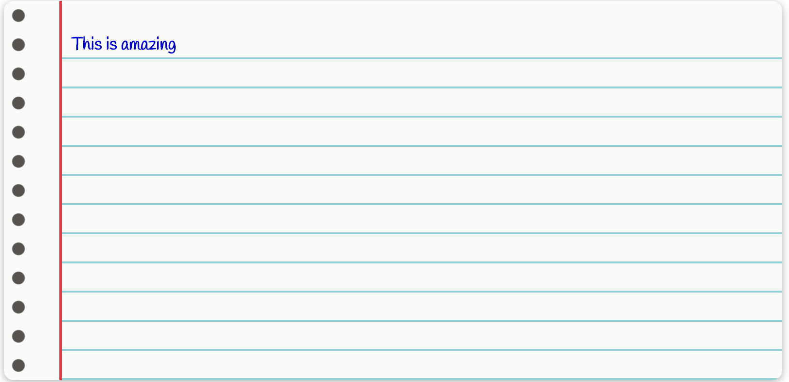
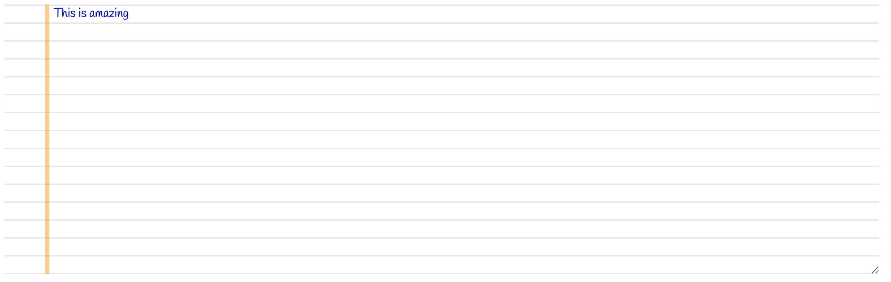
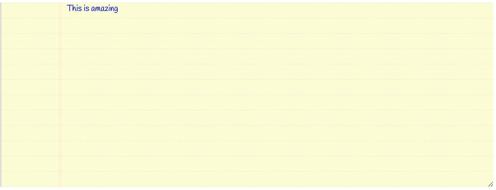

# vue-notebook-ui [](https://www.npmjs.com/package/vue-notebook-ui)
Vue component for giving html textarea a notebook/notepad feel.

### Install

**NPM**
```
npm i vue-notebook-ui
```
**Yarn**
```
yarn add vue-notebook-ui
```

### Samples

## Texture Paper Layout


## Empty Lined Paper


## Empty Lined Coloured Paper


### Usage

**main.js**

```javascript
import Vue from 'vue';
import NotebookUi from 'vue-notebook-ui';

Vue.use(NotebookUi);
```
**component**

```html
<template>
  <div>
    <notebook-ui
      :customStyle="{color:`orange`, 'text-decoration': 'bold'}"
      :content="content"
      placeholder="This is it"
      type="Texture"
      color="red"
    ></notebook-ui>
  </div>
</template>

<script>
export default {
  data() {
    return {
      content: "This is amazing"
    }
  },
}
</script>
```

## Props

Property|Type|Default|Description
---|---|---|---
type|String|EmptyLined|The type of the paper component, can be EmptyLined, EmptyLinedColored, Texture
content|String|Write note here|The content of notebook
placeholder|String|Write note here|The placeholder of the notebook
color|String|mediumblue|The font color of the textarea
fontStyle|String|"Handlee", cursive|The font-family of the notebook
customStyle|Object|-|The style of the notebook, overrides any style used


Made with ❤️ by Joshua Chinemezu
